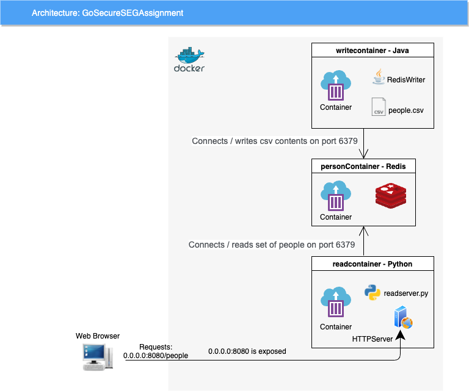

# GoSecureSEGAssignment

## Overview

This project consists of 3 containers:
- A Redis data store
- A java-based container that reads from a CSV file with 4 columns:
Name, Address, Phone Number, and Email
The rows are serialized as JSON, and then inserted against the "person" key in Redis as a set.
- A Python-based container that contains an HTTPServer. When a browser requests the "/people" URI, the HTTPServer queries the "person" key in Redis, then deserializes and displays the results.

### Architecture Diagram



## Setup Instructions

### 1) Build the writecontainer module:
There are two options to build the writecontainer:
#### Option 1) build with tests (requires a running Redis image):
```
docker pull redis
docker run --name personDirectory -p 6379:6379 redis
```
While it's running:
```
cd writecontainer
mvn assembly:assembly -DdescriptorId=jar-with-dependencies
```

#### Option 2) build and skip tests:
```
cd writecontainer
mvn assembly:assembly -DdescriptorId=jar-with-dependencies -Dmaven.test.skip=true
```

### 2) Build and run the docker images:
```
docker-compose up
```

### 3) Access in a browser.

The readcontainer module's HTTP Server will respond if you visit:
0.0.0.0:8080/people
